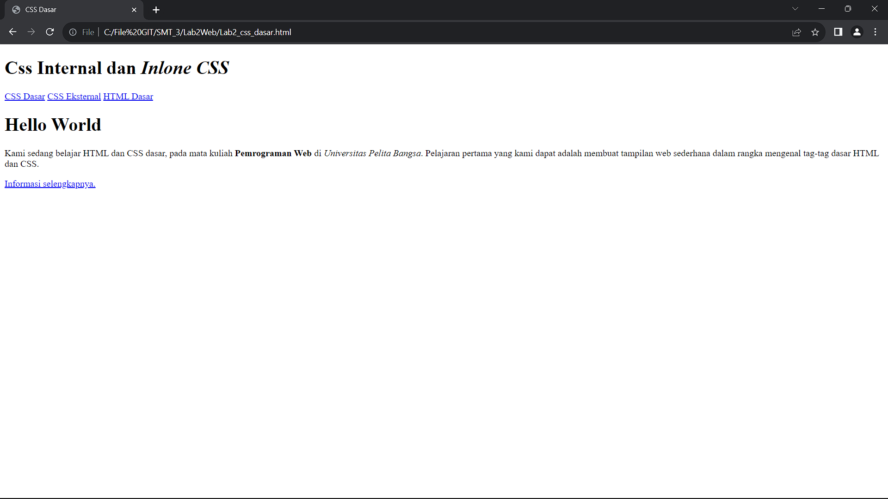
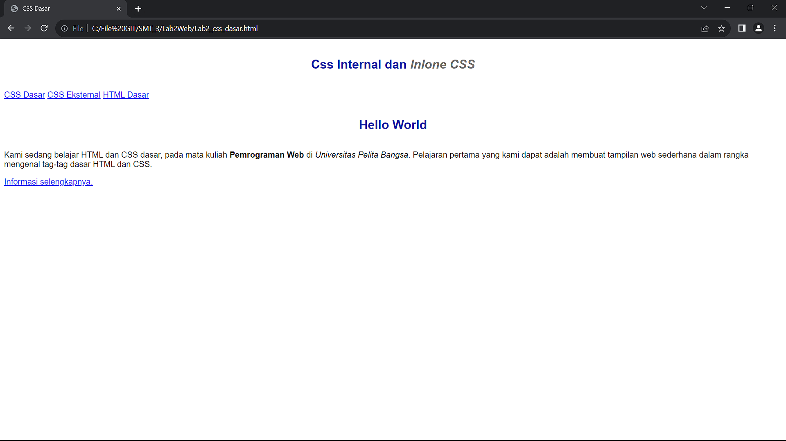
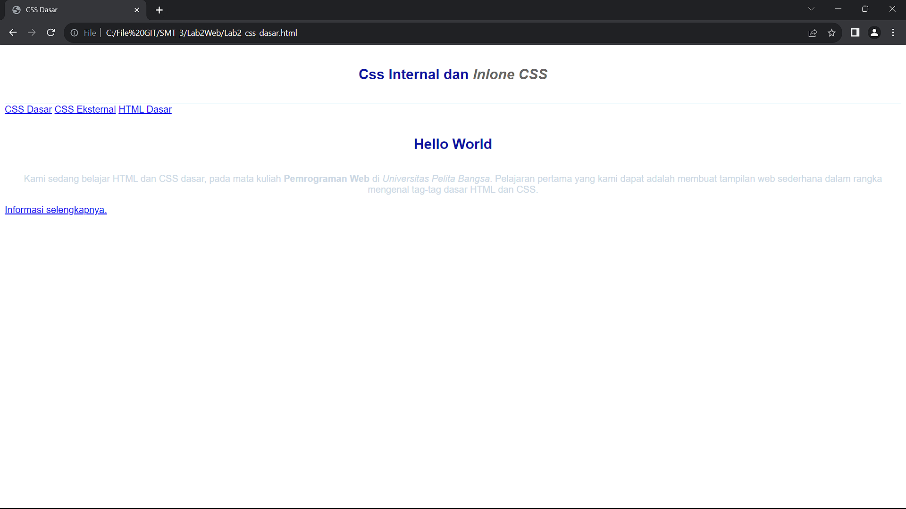
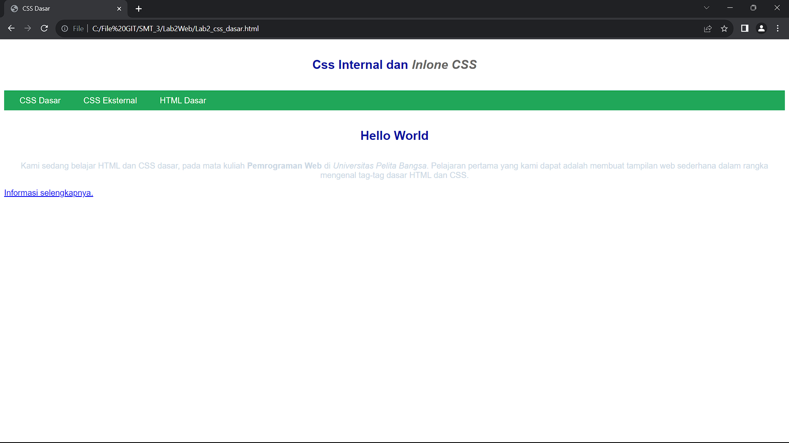
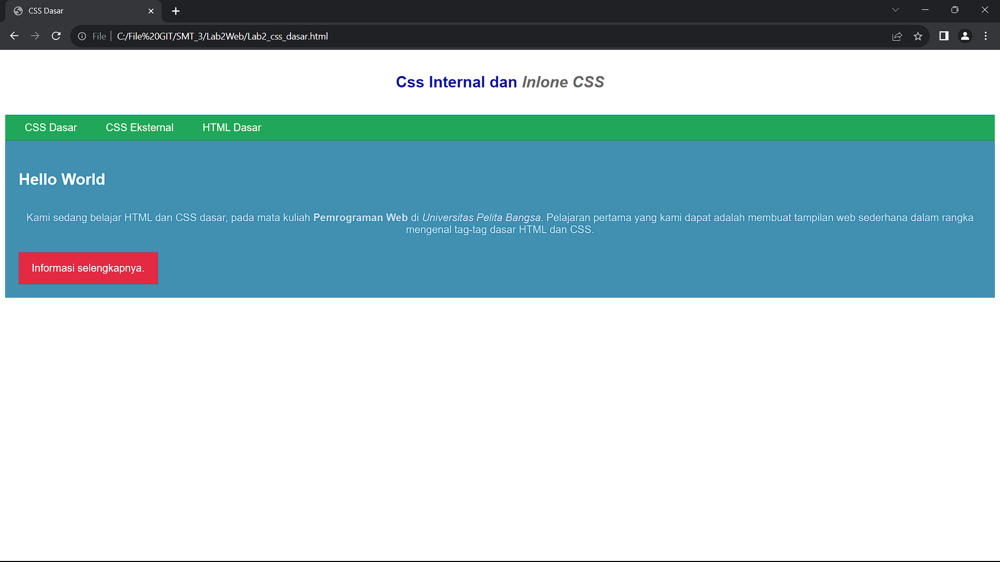

# Lab2Web

```
Nama    : Fadhlurohman Fatikh Navintino
NIM     : 312210368
Kelas   : TI.2.A4
```

## **Instruksi Praktikum**

1. Persiapkan text editor misalnya VSCode.
2. Buat file baru dengan nama lab2_css_dasar.html
3. Buat struktur dasar dari dokumen HTML.
4. Ikuti langkah-langkah praktikum yang akan dijelaskan berikutnya.
5. Lakukan validasi dokumen css dengan mengakses https://jigsaw.w3.org/css-validator/

## **Langkah-langkah Praktikum**

1. Membuat Dokumen HTML

```html
<!DOCTYPE html>
<html lang="en">
  <head>
    <meta charset="UTF-8" />
    <meta name="viewport" content="width=device-width, initial-scale=1.0" />
    <title>CSS Dasar</title>
  </head>
  <body>
    <header>
      <h1>Css Internal dan <i>Inlone CSS</i></h1>
    </header>
    <nav>
      <a href="lab2_css_dasar.html">CSS Dasar</a>
      <a href="lab2_css_eksternal.html">CSS Eksternal</a>
      <a href="lab1_tag_dasar.html">HTML Dasar</a>
    </nav>
    <!-- CSS ID Selector -->
    <div id="intro">
      <h1>Hello World</h1>
      <p>
        Kami sedang belajar HTML dan CSS dasar, pada mata kuliah
        <b>Pemrograman Web</b> di <i>Universitas Pelita Bangsa</i>. Pelajaran
        pertama yang kami dapat adalah membuat tampilan web sederhana dalam
        rangka mengenal tag-tag dasar HTML dan CSS.
      </p>
      <!-- CSS Class Selector -->
      <a class="button btn-primary" href="#intro">Informasi selengkapnya.</a>
    </div>
  </body>
</html>
```

- Selanjutnya buka pada browser untuk melihat hasilnya.



2. Mendeklarasikan CSS Internal

```html
<head>
  <title>CSS Dasar</title>
  <style>
    body {
      font-family: "Open Sans", sans-serif;
    }
    header {
      min-height: 80px;
      border-bottom: 1px solid #77ccef;
    }
    h1 {
      font-size: 24px;
      color: #0f189f;
      text-align: center;
      padding: 20px 10px;
    }
    h1 i {
      color: #6d6a6b;
    }
  </style>
</head>
```

- Selanjutnya simpan perubahan yang ada, dan lakukan refresh pada browser untuk melihat
  hasilnya.



3. Menambahkan Inline CSS

```html
<p style="text-align: center; color: #ccd8e4"></p>
```



4. Membuat CSS Eksternal

- Buatlah file baru dengan nama style_eksternal.css kemudian buatlah deklarasi CSS

```css
nav {
background: #20A759;
color:#fff;
padding: 10px;
}
nav a {
color: #fff;
text-decoration: none;
padding:10px 20px;
}
nav .active,
nav a:hover {
background: #0B6B3A;
```

- Kemudian tambahkan tag <link> untuk merujuk file css yang sudah dibuat pada bagian <head>

```html
<!-- menyisipkan css eksternal -->
<link rel="stylesheet" href="style_eksternal.css" type="text/css" />
```

- Selanjutnya refresh kembali browser



5. Menambahkan CSS Selector

```css
/* ID Selector */
#intro {
  background: #418fb1;
  border: 1px solid #099249;
  min-height: 100px;
  padding: 10px;
}
#intro h1 {
  text-align: left;
  border: 0;
  color: #fff;
}
/* Class Selector */
.button {
  padding: 15px 20px;
  background: #bebcbd;
  color: #fff;
  display: inline-block;
  margin: 10px;
  text-decoration: none;
}
.btn-primary {
  background: #e42a42;
}
```



## **Pertanyaan dan tugas**

1.  Lakukan eksperimen dengan mengubah dan menambah properti dan nilai pada kode CSS
    dengan mengacu pada CSS Cheat Sheet yang diberikan pada file terpisah dari modul ini.

    **Jawaban:** 
    
    - Mengubah Font Style dan Size
    ```css
    #intro {
      font-family: Arial, sans-serif;
      font-size: 18px;
      font-weight: bold;
    }
    ```
2.  Apa perbedaan pendeklarasian CSS elemen h1 {...} dengan #intro h1 {...}? berikan
    penjelasannya!

    **Jawaban:**

    Elemen h1 {...}:
    -Ini adalah contoh dari selektor elemen.
    -Ini akan memengaruhi semua elemen (h1) pada halaman web

    Elemen #intro h1 {...}:
    -Ini adalah contoh dari selektor id gabungan dengan elemen.
    -Ini akan memengaruhi hanya elemen (h1) yang berada di dalam elemen dengan ID "intro".

3.  Apabila ada deklarasi CSS secara internal, lalu ditambahkan CSS eksternal dan inline CSS pada
    elemen yang sama. Deklarasi manakah yang akan ditampilkan pada browser? Berikan
    penjelasan dan contohnya!
    **Jawaban:**

    CSS Inline:
    - CSS inline adalah CSS yang diterapkan langsung pada elemen HTML menggunakan atribut "style" di dalam tag elemen.

      **Contoh**

    ```html
    <p style="color: red;">Ini adalah teks dengan warna merah.</p>
    ```

    CSS Internal:

    - CSS internal adalah CSS yang ditempatkan di dalam tag <style> di dalam elemen <head> dokumen HTML.
      **Contoh**

    ```html
    <head>
      <style>
        p {
          color: blue;
        }
      </style>
    </head>
    ```

    CSS Eksternal: - CSS eksternal adalah CSS yang ditempatkan dalam berkas terpisah dan dihubungkan dengan dokumen HTML menggunakan tag <link>.

    ```html
    <head>
      <link rel="stylesheet" type="text/css" href="styles.css" />
    </head>
    ```

    Jadi, urutan prioritas adalah: CSS Inline > CSS Internal > CSS Eksternal.

4.  Pada sebuah elemen HTML terdapat ID dan Class, apabila masing-masing selector tersebut
    terdapat deklarasi CSS, maka deklarasi manakah yang akan ditampilkan pada browser?
    Berikan penjelasan dan contohnya! ( <p id="paragraf-1" class="text-paragraf"> )

    **Jawaban**

    Ketika sebuah elemen HTML memiliki baik ID maupun class, dan masing-masing selector tersebut memiliki deklarasi CSS, maka deklarasi yang akan ditampilkan oleh browser adalah deklarasi yang menggunakan ID. Ini karena selektor ID memiliki prioritas yang lebih tinggi daripada selektor class.

    **Contoh**

    ```html
    <p id="paragraf-1" class="text-paragraf">Ini adalah teks paragraf.</p>
    ```
    - Deklarasi CSS yang mengggunakan ID:

    ```css
    #paragraf-1 {
    color: blue;
    }
    ```

    - Deklarasi CSS yang menggunakan class:
    ```css
    .text-paragraf {
    font-weight: bold;
    }
    ```